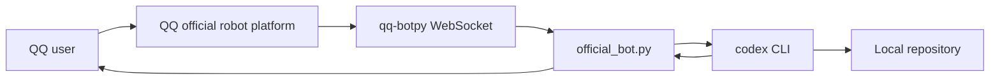
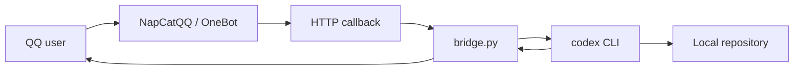

# QQ Codex Bridge

<p align="center">
  <strong>Use natural-language QQ messages to control a local Codex CLI session.</strong>
</p>

<p align="center">
  
  
  
  
</p>

QQ Codex Bridge connects QQ messages to a local repository through the Codex CLI. You talk to a QQ bot in normal language, the bridge starts `codex` in your configured workspace, and QQ receives Codex's final answer.

> [!IMPORTANT]
> This project is a control surface for a local coding agent. Keep allowlists enabled, run Codex with a conservative sandbox, and never commit QQ AppSecret or OpenAI credentials.

## Table Of Contents

- [Highlights](#highlights)
- [Architecture](#architecture)
- [Quick Start: Official QQ Robot](#quick-start-official-qq-robot)
- [OneBot Alternative](#onebot-alternative)
- [Configuration](#configuration)
- [Safety Defaults](#safety-defaults)
- [Service Setup](#service-setup)
- [Smoke Tests](#smoke-tests)
- [Troubleshooting](#troubleshooting)

## Highlights

| Capability | Description |
| --- | --- |
| Official QQ robot | Uses `qq-botpy` with AppID/AppSecret from the QQ robot platform. |
| OneBot fallback | Supports NapCatQQ-style HTTP callbacks through `bridge.py`. |
| Natural language | No command prefix required. Say things like "现在项目做到哪了？" or "停一下". |
| Safe-by-default auth | Uses OpenID / QQ user allowlists. `allow_all_users` defaults to `false`. |
| Risk confirmation | Requests confirmation before delete, reset, install, download, push, `sudo`, and service-level actions. |
| Clean replies | Filters Codex CLI headers, echoed prompts, and token counters before sending QQ messages. |

## Architecture

Official QQ robot path:



OneBot path:



## What You Can Say

```text
现在项目做到哪了？
看一下还有哪些没提交
只读代码，告诉我下一步怎么改
继续实现 batch sampler
跑一下测试，失败了就修
运行到哪了
停一下
取消
可以，继续
```

The bridge routes these messages internally as status checks, read-only analysis, write-capable tasks, approval, cancellation, stop requests, or running-task status.

## Requirements

- Linux host recommended.
- Python 3.11 or newer.
- Codex CLI installed and authenticated for the same user running the bridge.
- A local repository checkout that Codex can access.
- Official QQ robot credentials from [QQ robot platform](https://q.qq.com/qqbot/openclaw/) if using `official_bot.py`.

## Quick Start: Official QQ Robot

### 1. Clone

```bash
git clone <repo-url> /opt/qq-codex-bridge
cd /opt/qq-codex-bridge
cp config.official.example.toml config.official.toml
```

### 2. Install

```bash
python3 -m venv .venv
. .venv/bin/activate
pip install -r requirements-official.txt
```

### 3. Set Secrets

Use environment variables instead of writing secrets into files:

```bash
export QQ_BOT_APPID="your-appid"
export QQ_BOT_APPSECRET="replace-with-your-real-secret"
export QQ_BOT_BOOTSTRAP_SECRET="choose-a-long-random-temporary-phrase"
```

### 4. Configure Codex

Edit `config.official.toml`:

```toml
[codex]
workspace = "/absolute/path/to/your/repo"
command = "codex"
args = ["exec", "--sandbox", "{sandbox}", "-"]
sandbox = "workspace-write"
system_context = ""
```

Confirm Codex works:

```bash
cd /absolute/path/to/your/repo
codex --help
```

### 5. Start

```bash
cd /opt/qq-codex-bridge
. .venv/bin/activate
python3 official_bot.py --config config.official.toml
```

### 6. Bootstrap Your OpenID

Send the bootstrap phrase to the QQ bot. The bot replies with `user_openid` or `member_openid`.

Then update `config.official.toml`:

```toml
[official_qq]
allowed_openids = ["returned-openid-here"]
bootstrap_secret = ""
```

Restart the bridge. Only allowlisted OpenIDs can control Codex.

## OneBot Alternative

Use this path only if you run NapCatQQ or another OneBot-compatible adapter.

```bash
cp config.example.toml config.toml
python3 bridge.py --config config.toml
```

Minimal config:

```toml
[auth]
allow_all_users = false
allowed_user_ids = [123456789]
bot_user_id = 987654321

[codex]
workspace = "/absolute/path/to/your/repo"
```

Configure your OneBot HTTP post URL:

```text
http://127.0.0.1:8787/onebot
```

Synthetic local event:

```bash
python3 send_test_event.py --user-id 123456789 --text "现在项目做到哪了？"
```

## Configuration

### Codex Invocation

`codex.args` controls how the Codex CLI is invoked.

Default:

```toml
args = ["exec", "--sandbox", "{sandbox}", "-"]
```

Equivalent command:

```bash
codex exec --sandbox workspace-write -
```

The bridge sends the prompt on stdin. If your Codex CLI expects the prompt as an argument, use `{prompt}`:

```toml
args = ["exec", "--sandbox", "{sandbox}", "{prompt}"]
```

### Optional Prompt Context

`system_context` is prepended before the QQ message. Keep it empty unless you need bridge-specific instructions. Repository rules should usually live in `AGENTS.md`.

### Reply Behavior

```toml
[behavior]
send_start_ack = false
send_heartbeat = false
max_message_chars = 1400
```

With the defaults, QQ receives only the final Codex answer unless an error or approval request is needed.

## Safety Defaults

Recommended defaults:

```toml
allow_all_users = false
sandbox = "workspace-write"
auto_run_safe_tasks = true
send_start_ack = false
send_heartbeat = false
```

The bridge asks for confirmation before requests that look risky, but it is not a sandbox. Codex sandboxing, OS permissions, and your service account remain the real enforcement layers.

> [!WARNING]
> Do not expose the OneBot HTTP callback endpoint to the public internet. Bind to `127.0.0.1` or put it behind a trusted private network.

## Service Setup

Create `/etc/systemd/system/qq-codex-bridge.service`:

```ini
[Unit]
Description=QQ Codex Bridge
After=network-online.target

[Service]
Type=simple
WorkingDirectory=/opt/qq-codex-bridge
ExecStart=/opt/qq-codex-bridge/.venv/bin/python /opt/qq-codex-bridge/official_bot.py --config /opt/qq-codex-bridge/config.official.toml
Restart=on-failure
RestartSec=5
Environment=PYTHONUNBUFFERED=1
Environment=QQ_BOT_APPID=your-appid
Environment=QQ_BOT_APPSECRET=replace-with-your-real-secret
Environment=QQ_BOT_BOOTSTRAP_SECRET=

[Install]
WantedBy=multi-user.target
```

Start it:

```bash
sudo systemctl daemon-reload
sudo systemctl enable --now qq-codex-bridge
sudo journalctl -u qq-codex-bridge -f
```

## Smoke Tests

Syntax:

```bash
python3 -m py_compile bridge.py official_bot.py send_test_event.py
```

Intent routing:

```bash
python3 bridge.py --classify "运行到哪了"
```

Codex output filtering:

```bash
python3 bridge.py --summarize-output-file tests/sample_codex_output.txt
```

Official config validation:

```bash
QQ_BOT_APPID=test QQ_BOT_APPSECRET=test QQ_BOT_BOOTSTRAP_SECRET=temporary-secret-12345 \
python3 official_bot.py --config config.official.example.toml --show-config
```

## Troubleshooting

### `消息被去重，请检查请求msgseq`

The official QQ API deduplicates multiple replies to the same inbound message unless `msg_seq` changes. `official_bot.py` increments `msg_seq` for each reply.

### Codex header, prompt, or `tokens used` appears in QQ

The bridge filters common Codex CLI transcript noise in `summarize_codex_output`. If your Codex CLI output format differs, add a sample under `tests/` and adjust the filter.

### No response after a message

Ask:

```text
运行到哪了
```

The bridge reports whether a Codex process is running. Enable `send_heartbeat = true` if you want periodic progress messages.

## License

MIT. See [`LICENSE`](LICENSE).
